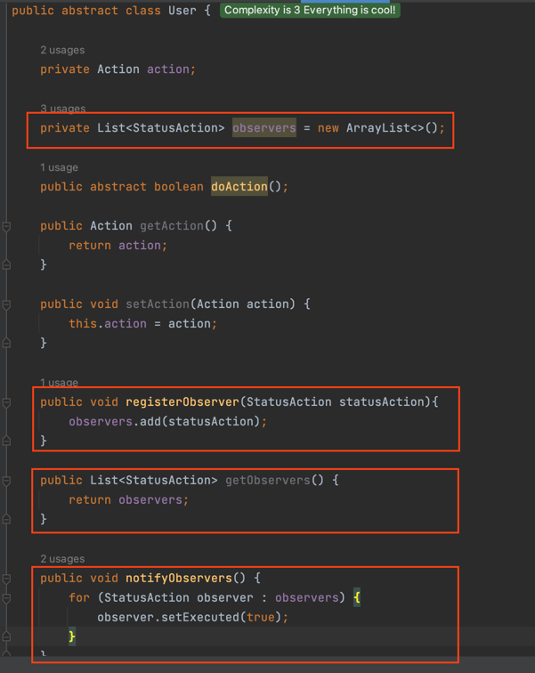
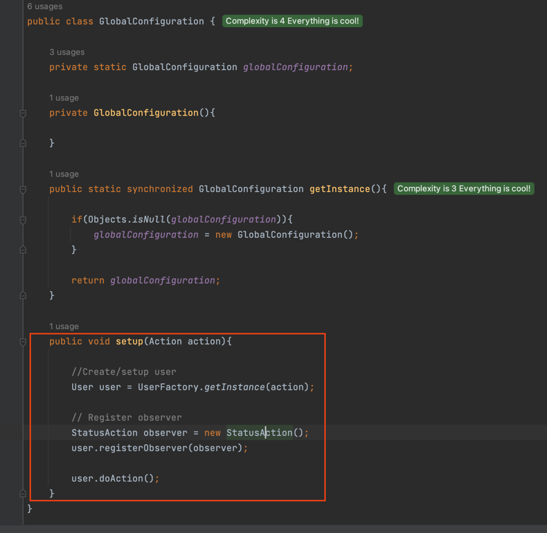
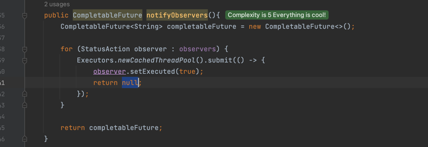
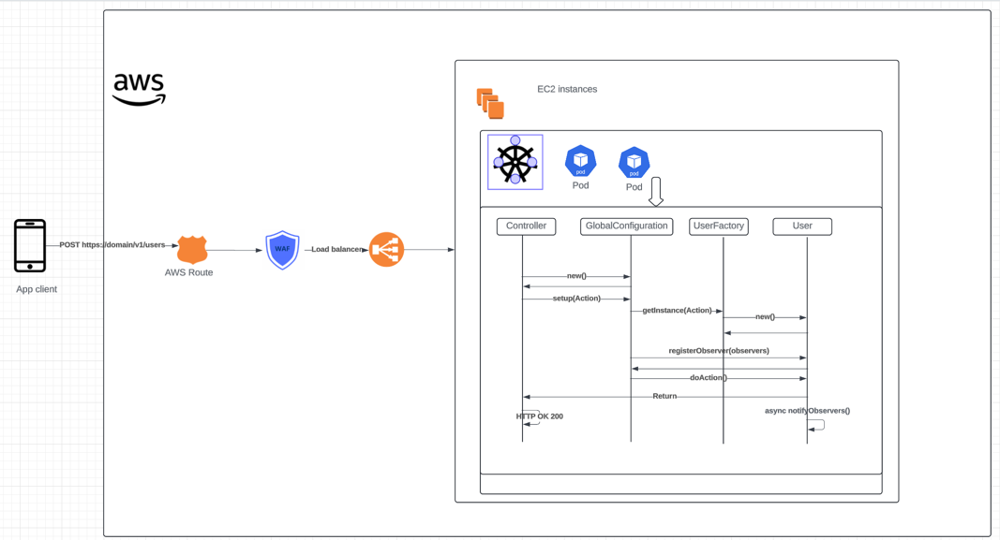

## lab-7 Integrating Design Patterns in a Project Scenario

### Tasks

##### 1. Design Problem Solving:

* <b>Scenario Description:</b> Participants are provided with a series of common software design challenges. They will need to choose appropriate design patterns to solve these specific problems effectively.

* <b>Design Challenges:</b>

  * <b>Global Configuration Management:</b> Design a system that ensures a single, globally accessible configuration object without access conflicts.

  * <b>Dynamic Object Creation Based on User Input:</b> Implement a system to dynamically create various types of user interface elements based on user actions.

  * <b>State Change Notification Across System Components:</b> Ensure components are notified about changes in the state of other parts without creating tight coupling.

  * <b>Efficient Management of Asynchronous Operations:</b> Manage multiple asynchronous operations like API calls which need to be coordinated without blocking the main application workflow.
  

* <b>Task:</b> Outline solutions that integrate these patterns into a cohesive design to address the challenges.

##### 2. Project Execution Simulation:

Simulate the application of these patterns in a hypothetical software project. Document the approach, rationale, and integration process of the chosen patterns as they apply to the design challenges.

# Solution

### -> Global Config Management

<u>Requirement be designed using a **Singleton Pattern** </u>

    import java.util.Objects;

    public class GlobalConfiguration {
    
        private static GlobalConfiguration globalConfiguration;
    
        private GlobalConfiguration(){
          // properties initialization
        }

        public static synchronized GlobalConfiguration getInstance(){
            
            if(Objects.isNull(globalConfiguration)){
                globalConfiguration = new GlobalConfiguration();
            }
            
            return globalConfiguration;
        }
    }

### -> Dynamic Object Creation Based on User Input

<u>Creation process will be designed by using a **Factory Pattern**</u>

// Define Action catalog

    public enum Action {
      AUTHORIZE, 
      ANALYZE
    }

// Define User domain
    
    import com.fjcd.constant.Action;
    
    public abstract class User {
    
        private Action action;
    
        protected abstract boolean doAction();
    
    }

// Create specific implementations for user action
    
    public class UserAnalyst extends User {
    
        @Override
        protected boolean doAction() {
    
            System.out.println("Executing " + Action.ANALYZE);
    
            return true;
        }
    
    }

 //

    public class UserAuthorizer extends User {
    
        @Override
        protected boolean doAction() {
    
            System.out.println("Executing " + Action.AUTHORIZE);
    
            return true;
        }
    
    }

// Create Factory class owner of creation logic
    
    public class UserFactory {

        public User getUser(Action action) {
    
            if (Action.ANALYZE.equals(action)) {

                return new UserAnalyst();

            } else if (Action.AUTHORIZE.equals(action)) {

                return new UserAuthorizer();
            }
    
            throw new RuntimeException("Action Not Supported");
        }
    
    }

### -> State Change Notification Across System Components:

<u> Requirement will be designed by using a **Observer pattern** </u>

Define a Observer class

    public class StatusAction {
    
        private UUID identifier;
        private boolean executed;
    
    
        public StatusAction(){
            this.identifier = UUID.randomUUID();
        }
    
        public boolean isExecuted() {
            return executed;
        }
    
        public void setExecuted(boolean executed) {
            this.executed = executed;
        }
    
        public UUID getIdentifier() {
            return identifier;
        }
    
        public void setIdentifier(UUID identifier) {
            this.identifier = identifier;
        }
    
    }

We update the User  class with following changes 
* Adding observers attribute in class
* Adding a method that registers a new observer
* Adding GET observable array
* Add a method that updates/notifies the state change to the entire Observers array

We update Specific implements to add notify method after execute specific actions

    public class UserAuthorizer extends User {
    
        @Override
        public boolean doAction() {
    
            System.out.println("Executing " + Action.AUTHORIZE);
    
            // New Line added, to update observers
            this.notifyObservers();
    
            return true;
        }
    
    }

//

    public class UserAnalyst extends User {
    
        @Override
        public boolean doAction() {
    
            System.out.println("Executing " + Action.ANALYZE);

            // New Line added, to update observers
            this.notifyObservers();
    
            return true;
        }
    
    }

Here an example of setup object and observers from GlobalConfiguration

### -> Efficient Management of Asynchronous Operations

Supposed Mobile APP interacts with UserController, in oreder to create a User by Action Authorizer

Controller layer consuming User creation

    @ApplicationPath("/v1/users")
    public class UserController {
    
        private GlobalConfiguration globalConfiguration;
        
        
        @POST
        @Consumes(MediaType.APPLICATION_JSON)
        public void method(UserRequestDTO user){

            // Use nested Singleton logic
            globalConfiguration = GlobalConfiguration.getInstance();

            // Use nested Factory and observer pattern
            globalConfiguration.setup(user.getAction());
        }
    }

We could update user.notifyObservers with some scenarios :
* Change notifyObservers to an Async process/logic
* Change nested logic of notifyObservers to call maybe to AWS Kinesis or GCP Pub/subscriptions to update other third party services

Here the first option

### -> Project Execution Simulation:

* App client send HTTP POST resquest /v1/users indicating in body Action
* Controller 
  * get singletone instance of GlobalConguation
  * call to setup user by Action (factory pattern nested logic)
* ConfigurtionManager
  * create and setup/register observers into User object
* User
  * doAction
  * send Update status via Asynchronous Notifications
  * return response method does not matter if notifications results finished
* Controller 
  * return response method does not matter if notifications results finished

Note: Also could imagine Notifications would be send to Cloud tool like SQS or Kinesis, or using kafka and Consumers or suscriptors resolve or execute complex process, 
but this process is async, so client app will not have to wait the API notification result

